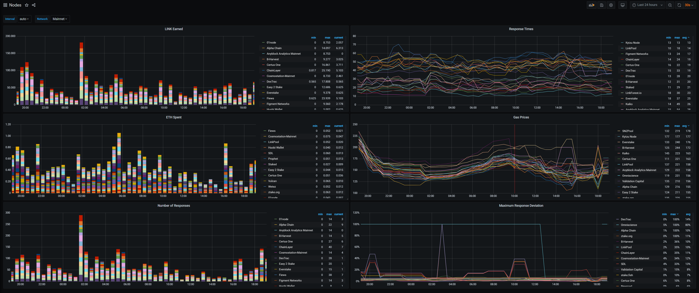

# Market Metrics - Example Grafana Dashboards

A set of example dashboards using [market.link](https://market.link) metrics API, giving a high level overview of the 
Chainlink network. Included dashboards are:

 - Feeds: showing the latest answer, answer deviation, response times, gas prices for a given specific Chainlink feed
 - All Feeds: high-level dashboard giving an overview of all feeds, when they last updated and their health
 - Nodes: overall nodes dashboard showing how much LINK earned, ETH spent, all gas prices and response times
 
## Screenshot



## Setup

Make sure `docker-compose` installed.

- Run: `docker-compose up`
- Browse to `http://localhost:3000`
- Login with `admin` & `admin`

### Troubleshooting

If you cannot make any updates in Grafana due to a database is read-only error. Run:
```
chown -R 472:472 database
```

## Contributing

Open to any contributions with extra dashboards and improvements, fork and submit a PR.
